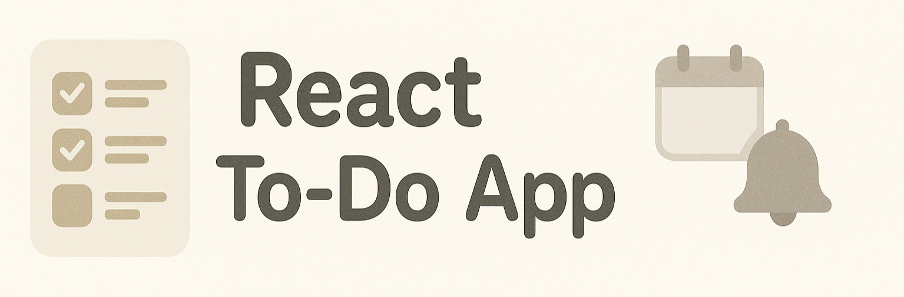

 


# MyToDoList - React Project

Un proyecto simple de lista de tareas (ToDo List) realizado con React. Permite agregar, eliminar, marcar como completadas, y eliminar tareas. Ideal para gestionar actividades diarias.

## Instalation

Follow these steps to run the project on your local machine:

1. Clone the repository:
```bash
git clone https://github.com/chrisestabaocupado/todolist-react.git
```

2. Navigate to the project directory:
```bash
cd todolist-react
```

3. Install dependencies:
```bash
npm install
```

4. Start the development server:
```bash
npm start
```

The project should be available at http://localhost:5173 or the configured port.

## Usage

Once the server is running, you can:
- Add a task: Type the task in the input field and click "Add."
- Mark as completed: Click the checkbox next to a task to mark it as completed.
- Delete a task: Click the trash icon next to a task to delete it.
- Filter tasks: Use the buttons to view all tasks, only completed tasks, or only active tasks.

# Technologies Used
- React: A library for building user interfaces.
- React Hooks: Using hooks like useState, useEffect to manage state and side effects.
- Tailwind: Basic styles for the application design.
